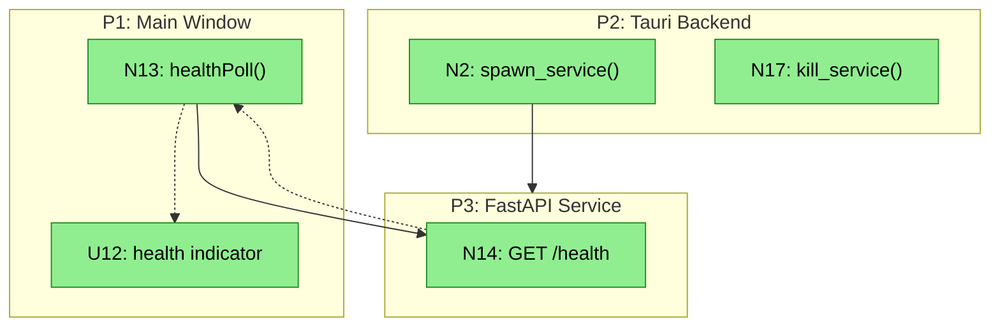
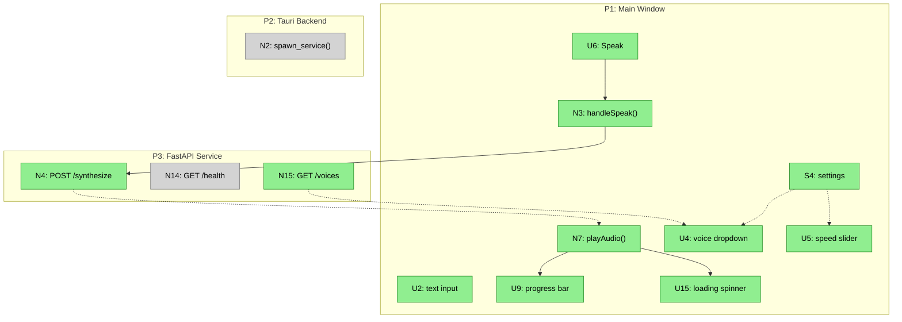
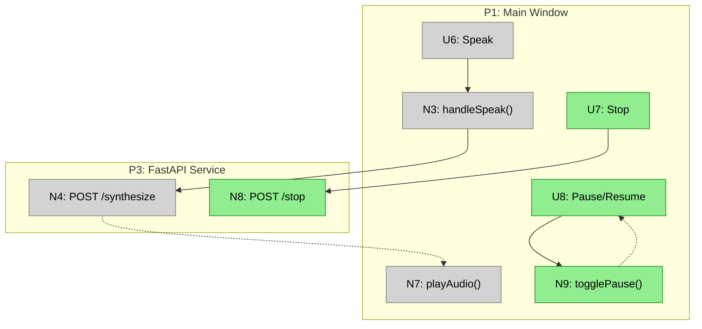
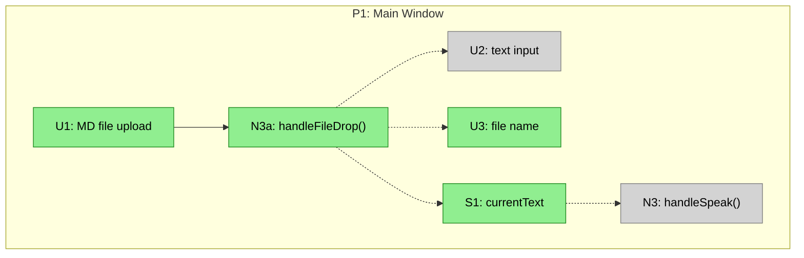
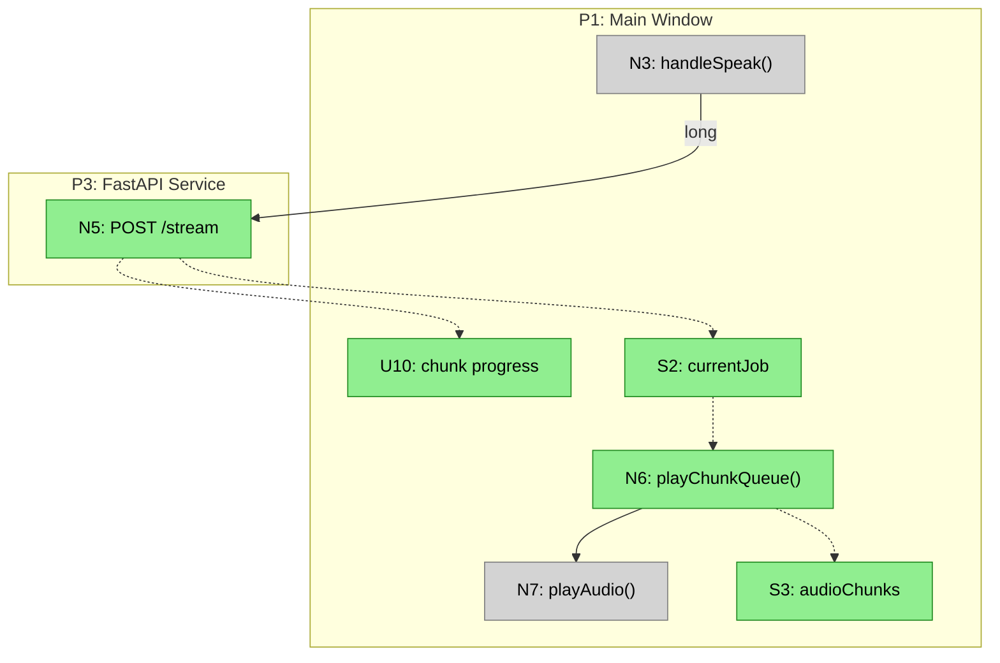
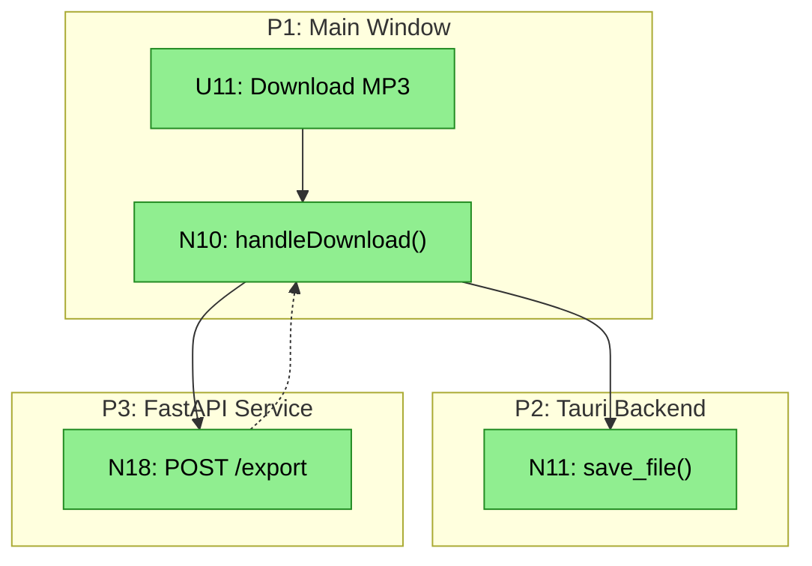
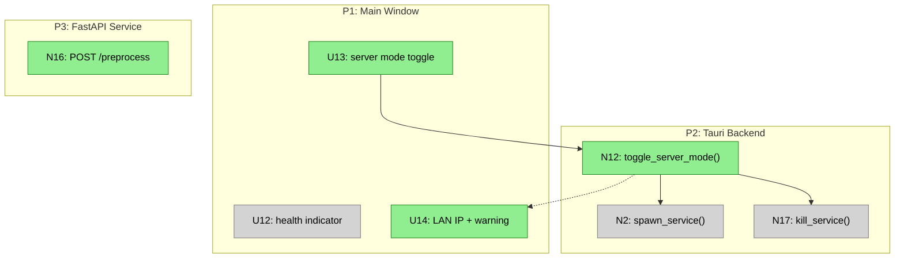

# Local Voice Desktop App — Shaping

## Source

> The current extension doesn't work well with selected text. There are several issues that need to be fixed. But before fixing the extension, I have an idea to create a desktop application that can:
> 1. Read uploaded MD file
> 2. Allow download the MP3 of the voice
> 3. Copy/paste text and repeat 1/2
> 4. It can run the server mode so external API will be available to create TTS (Read/Download)

---

## Requirements (R)

| ID | Requirement | Status |
|----|-------------|--------|
| R0 | Convert text/markdown to speech and get downloadable audio files | Core goal |
| R1 | Accept input via file upload (MD), strip markdown + frontmatter | Must-have |
| R2 | Accept input via paste/type | Nice-to-have |
| R3 | Download output as MP3 | Nice-to-have |
| R4 | Expose TTS as an HTTP API (server mode) | Must-have |
| R5 | Works outside the browser (standalone app) | Must-have |
| R6 | Wraps existing Kokoro TTS FastAPI service | Must-have |
| R7 | Built with Tauri (Rust + web frontend) | Must-have |
| R8 | Python + uv required on host, documented in README prerequisites | Must-have |
| R9 | 🟡 Server mode must warn user about LAN exposure; display real LAN IP, not 0.0.0.0 | Must-have |

---

## Selected Shape: A — Sidecar

Tauri app launches the existing FastAPI TTS service as a subprocess. Plain HTML/JS frontend for input, playback, and download.

| Part | Mechanism |
|------|-----------|
| **A1** | **Sidecar management** — Tauri spawns `uv run` to start FastAPI on startup, kills on quit |
| **A2** | **Web frontend** — plain HTML/JS/CSS in Tauri webview: file upload, text input, audio player, download via Tauri save dialog |
| **A3** | **MD stripping** — 🟡 client-side JS strips frontmatter + markdown syntax before sending to TTS. Python `POST /preprocess` endpoint exists only for server mode API consumers |
| **A4** | **API passthrough** — frontend calls FastAPI on localhost for synthesize/stream/voices/health |
| **A5** | **Server mode** — 🟡 restart sidecar with `LV_HOST=0.0.0.0`; show confirmation warning about unauthenticated LAN exposure; display real LAN IP (e.g., `192.168.1.x:5517`) |
| **A6** | **Long document handling** — 🟡 `/stream` generates all chunks (batch), then frontend fetches and plays them sequentially from the queue. Download calls `POST /export` which concatenates chunks server-side via ffmpeg |

---

## Fit Check: R × A

| Req | Requirement | Status | A |
|-----|-------------|--------|---|
| R0 | Convert text/markdown to speech and get downloadable audio files | Core goal | ✅ |
| R1 | Accept input via file upload (MD), strip markdown + frontmatter | Must-have | ✅ |
| R2 | Accept input via paste/type | Nice-to-have | ✅ |
| R3 | Download output as MP3 | Nice-to-have | ✅ |
| R4 | Expose TTS as an HTTP API (server mode) | Must-have | ✅ |
| R5 | Works outside the browser (standalone app) | Must-have | ✅ |
| R6 | Wraps existing Kokoro TTS FastAPI service | Must-have | ✅ |
| R7 | Built with Tauri (Rust + web frontend) | Must-have | ✅ |
| R8 | Python + uv required on host, documented in README prerequisites | Must-have | ✅ |
| R9 | Server mode must warn user about LAN exposure; display real LAN IP | Must-have | ✅ |

---

## Breadboard

### Places

| # | Place | Description |
|---|-------|-------------|
| P1 | Main Window | Tauri webview — input, controls, playback, download |
| P2 | Tauri Backend | Rust commands for sidecar lifecycle and save dialog |
| P3 | FastAPI Service | Python TTS service (existing + new MD endpoint) |

### UI Affordances

| # | Place | Component | Affordance | Control | Wires Out | Returns To |
|---|-------|-----------|------------|---------|-----------|------------|
| U1 | P1 | input-area | MD file drop/upload zone | drop/click | → N3a | — |
| U2 | P1 | input-area | text input area | type/paste | — | — |
| U3 | P1 | input-area | file name display | render | — | — |
| U4 | P1 | controls | voice dropdown | select | — | — |
| U5 | P1 | controls | speed slider | slide | — | — |
| U6 | P1 | controls | "Speak" button | click | → N3 | — |
| U7 | P1 | controls | "Stop" button | click | → N8 | — |
| U8 | P1 | controls | "Pause/Resume" button | click | → N9 | — |
| U9 | P1 | playback | audio progress bar | render | — | — |
| U10 | P1 | playback | chunk progress ("3/12") | render | — | — |
| U11 | P1 | controls | "Download MP3" button | click | → N10 | — |
| U12 | P1 | status-bar | service health indicator | render | — | — |
| U13 | P1 | status-bar | server mode toggle | click | → N12 | — |
| U14 | P1 | status-bar | server mode LAN IP + warning | render | — | — |
| U15 | P1 | playback | loading spinner | render | — | — |

### Code Affordances

| # | Place | Component | Affordance | Control | Wires Out | Returns To |
|---|-------|-----------|------------|---------|-----------|------------|
| N2 | P2 | sidecar | `spawn_service()` — start FastAPI via `uv run` on app launch | call | → P3 | — |
| N3 | P1 | app.js | `handleSpeak()` — get text from U2, voice/rate from U4/U5, choose synthesize vs stream | call | → N4 or → N5 | — |
| N3a | P1 | app.js | `handleFileDrop()` — read file via File API, strip MD/frontmatter client-side, populate U2 + U3 | call | — | → U2, → U3, → S1 |
| N4 | P3 | synthesize | `POST /synthesize` — short text → single audio blob | call | — | → N7 |
| N5 | P3 | stream | `POST /stream` — long text → batch-generates all chunks, returns job_id + chunk URLs | call | — | → S2, → U10 |
| N6 | P1 | app.js | `playChunkQueue()` — fetch chunk URLs sequentially from S2, play each in order | call | → N7 | → S3 |
| N7 | P1 | app.js | `playAudio()` — feed blob to `<audio>` element | call | — | → U9, → U15 |
| N8 | P3 | stop | `POST /stop` — cancel streaming job | call | — | — |
| N9 | P1 | app.js | `togglePause()` — pause/resume `<audio>` element | call | — | → U8 |
| N10 | P1 | app.js | `handleDownload()` — call export endpoint, receive single MP3, trigger save dialog | call | → N18, → N11 | — |
| N11 | P2 | sidecar | `save_file()` — Tauri save dialog, write MP3 to disk | call | — | — |
| N12 | P2 | sidecar | `toggle_server_mode()` — kill sidecar, restart with `LV_HOST=0.0.0.0` or `127.0.0.1`; resolve LAN IP; show warning | call | → N2 | → U14 |
| N13 | P1 | app.js | `healthPoll()` — poll `GET /health` every 3s | call | → N14 | → U12 |
| N14 | P3 | health | `GET /health` — returns engine status | call | — | → N13 |
| N15 | P3 | voices | `GET /voices` — returns available voices | call | — | → U4 |
| N16 | P3 | preprocess | `POST /preprocess` — strip frontmatter + MD syntax, return plain text (server mode API only) | call | — | caller |
| N17 | P2 | sidecar | `kill_service()` — terminate FastAPI on app quit | call | — | — |
| N18 | P3 | export | `POST /export` — concatenate chunk MP3s via ffmpeg into single file, return blob | call | — | → N10 |

### Data Stores

| # | Place | Store | Description |
|---|-------|-------|-------------|
| S1 | P1 | `currentText` | Plain text ready for TTS (after MD stripping) |
| S2 | P1 | `currentJob` | Active stream job_id + chunk URLs |
| S3 | P1 | `audioChunks` | Cached audio blobs for download stitching |
| S4 | P1 | `settings` | voice, rate, serverMode — persisted to localStorage |

### Wiring Diagram

```mermaid
flowchart TB
    subgraph P1["P1: Main Window"]
        subgraph input["Input Area"]
            U1["U1: MD file upload"]
            U2["U2: text input"]
            U3["U3: file name"]
        end

        subgraph controls["Controls"]
            U4["U4: voice dropdown"]
            U5["U5: speed slider"]
            U6["U6: Speak"]
            U7["U7: Stop"]
            U8["U8: Pause/Resume"]
            U11["U11: Download MP3"]
        end

        subgraph playback["Playback"]
            U9["U9: progress bar"]
            U10["U10: chunk progress"]
            U15["U15: loading spinner"]
        end

        subgraph statusBar["Status Bar"]
            U12["U12: health indicator"]
            U13["U13: server mode toggle"]
            U14["U14: LAN IP + warning"]
        end

        N3["N3: handleSpeak()"]
        N3a["N3a: handleFileDrop()"]
        N6["N6: playChunkQueue()"]
        N7["N7: playAudio()"]
        N9["N9: togglePause()"]
        N10["N10: handleDownload()"]
        N13["N13: healthPoll()"]

        S1["S1: currentText"]
        S2["S2: currentJob"]
        S3["S3: audioChunks"]
        S4["S4: settings"]
    end

    subgraph P2["P2: Tauri Backend"]
        N2["N2: spawn_service()"]
        N11["N11: save_file()"]
        N12["N12: toggle_server_mode()"]
        N17["N17: kill_service()"]
    end

    subgraph P3["P3: FastAPI Service"]
        N4["N4: POST /synthesize"]
        N5["N5: POST /stream"]
        N8["N8: POST /stop"]
        N14["N14: GET /health"]
        N15["N15: GET /voices"]
        N16["N16: POST /preprocess"]
        N18["N18: POST /export"]
    end

    %% File drop: read + strip MD client-side
    U1 -->|drop| N3a
    N3a -.-> U2
    N3a -.-> U3
    N3a -.-> S1

    %% Speak
    U6 -->|click| N3
    S1 -.-> N3

    %% Short text path
    N3 -->|short| N4
    N4 -.-> N7

    %% Long text path (batch then queue)
    N3 -->|long| N5
    N5 -.-> S2
    N5 -.-> U10
    S2 -.-> N6
    N6 --> N7
    N6 -.-> S3

    %% Playback
    N7 --> U9
    N7 --> U15
    U7 --> N8
    U8 --> N9
    N9 -.-> U8

    %% Download: server-side concat via ffmpeg
    U11 --> N10
    N10 --> N18
    N18 -.-> N10
    N10 --> N11

    %% Service lifecycle
    N2 --> P3
    N12 --> N17
    N12 --> N2
    U13 --> N12
    N12 -.-> U14

    %% Health & voices
    N13 --> N14
    N14 -.-> N13
    N13 -.-> U12
    N15 -.-> U4

    %% Settings
    S4 -.-> U4
    S4 -.-> U5

    classDef ui fill:#ffb6c1,stroke:#d87093,color:#000
    classDef nonui fill:#d3d3d3,stroke:#808080,color:#000
    classDef store fill:#e6e6fa,stroke:#9370db,color:#000

    class U1,U2,U3,U4,U5,U6,U7,U8,U9,U10,U11,U12,U13,U14,U15 ui
    class N2,N3,N3a,N4,N5,N6,N7,N8,N9,N10,N11,N12,N13,N14,N15,N16,N17,N18 nonui
    class S1,S2,S3,S4 store
```

---

## Slices

### Slice Summary

| # | Slice | Parts | Affordances | Demo |
|---|-------|-------|-------------|------|
| V1 | App boots, service starts | A1 | N2, N17, N13, N14, U12 | "Open app, health dot turns green" |
| V2 | Paste text, hear speech | A2, A4 | U2, U4, U5, U6, N3, N4, N7, N15, U9, U15, S4 | "Paste text, pick voice, click Speak, hear audio" |
| V3 | Playback controls | A2 | U7, U8, N8, N9 | "Pause, resume, stop during playback" |
| V4 | MD file upload + strip | A2, A3 | U1, U3, N3a, S1 | "Drop .md file, see plain text appear, speak it" |
| V5 | Long document batch + queue | A6 | N5, N6, S2, S3, U10 | "Upload long doc, see '3/12' chunk progress as queue plays" |
| V6 | Download MP3 | A2, A6 | U11, N10, N11, N18 | "Click Download, server concats via ffmpeg, save dialog" |
| V7 | Server mode | A5 | U13, U14, N12, N16 | "Toggle on, see LAN IP + warning, curl from another machine" |

### V1: App boots, service starts

**Demo:** Open the app, watch the health indicator turn green within a few seconds.

| # | Place | Component | Affordance | Control | Wires Out | Returns To |
|---|-------|-----------|------------|---------|-----------|------------|
| U12 | P1 | status-bar | service health indicator | render | — | — |
| N2 | P2 | sidecar | `spawn_service()` | call | → P3 | — |
| N13 | P1 | app.js | `healthPoll()` | call | → N14 | → U12 |
| N14 | P3 | health | `GET /health` | call | — | → N13 |
| N17 | P2 | sidecar | `kill_service()` | call | — | — |

### V2: Paste text, hear speech

**Demo:** Paste text into the input area, select a voice, click Speak, hear audio playback with progress bar.

| # | Place | Component | Affordance | Control | Wires Out | Returns To |
|---|-------|-----------|------------|---------|-----------|------------|
| U2 | P1 | input-area | text input area | type/paste | — | — |
| U4 | P1 | controls | voice dropdown | select | — | — |
| U5 | P1 | controls | speed slider | slide | — | — |
| U6 | P1 | controls | "Speak" button | click | → N3 | — |
| U9 | P1 | playback | audio progress bar | render | — | — |
| U15 | P1 | playback | loading spinner | render | — | — |
| N3 | P1 | app.js | `handleSpeak()` | call | → N4 | — |
| N4 | P3 | synthesize | `POST /synthesize` | call | — | → N7 |
| N7 | P1 | app.js | `playAudio()` | call | — | → U9, → U15 |
| N15 | P3 | voices | `GET /voices` | call | — | → U4 |
| S4 | P1 | — | `settings` | store | — | → U4, → U5 |

### V3: Playback controls

**Demo:** While audio plays, click Pause — audio pauses. Click Resume — continues. Click Stop — cancels.

| # | Place | Component | Affordance | Control | Wires Out | Returns To |
|---|-------|-----------|------------|---------|-----------|------------|
| U7 | P1 | controls | "Stop" button | click | → N8 | — |
| U8 | P1 | controls | "Pause/Resume" button | click | → N9 | — |
| N8 | P3 | stop | `POST /stop` | call | — | — |
| N9 | P1 | app.js | `togglePause()` | call | — | → U8 |

### V4: MD file upload + strip

**Demo:** Drag a `.md` file onto the app, see filename appear, see stripped plain text in the input area, click Speak.

| # | Place | Component | Affordance | Control | Wires Out | Returns To |
|---|-------|-----------|------------|---------|-----------|------------|
| U1 | P1 | input-area | MD file drop/upload zone | drop/click | → N3a | — |
| U3 | P1 | input-area | file name display | render | — | — |
| N3a | P1 | app.js | `handleFileDrop()` — read via File API, strip MD client-side | call | — | → U2, → U3, → S1 |
| S1 | P1 | — | `currentText` | store | — | — |

### V5: Long document batch + queue

**Demo:** Upload a long markdown file, batch generates all chunks, then plays queue with "3/12" progress.

| # | Place | Component | Affordance | Control | Wires Out | Returns To |
|---|-------|-----------|------------|---------|-----------|------------|
| U10 | P1 | playback | chunk progress ("3/12") | render | — | — |
| N5 | P3 | stream | `POST /stream` — batch-generates all chunks, returns URLs | call | — | → S2, → U10 |
| N6 | P1 | app.js | `playChunkQueue()` — fetch + play chunks sequentially from S2 | call | → N7 | → S3 |
| S2 | P1 | — | `currentJob` | store | — | — |
| S3 | P1 | — | `audioChunks` | store | — | — |

### V6: Download MP3

**Demo:** After speaking, click Download MP3, server concatenates chunks via ffmpeg, save dialog appears, single `.mp3` saved.

| # | Place | Component | Affordance | Control | Wires Out | Returns To |
|---|-------|-----------|------------|---------|-----------|------------|
| U11 | P1 | controls | "Download MP3" button | click | → N10 | — |
| N10 | P1 | app.js | `handleDownload()` — call export, trigger save | call | → N18, → N11 | — |
| N11 | P2 | sidecar | `save_file()` — Tauri save dialog | call | — | — |
| N18 | P3 | export | `POST /export` — concat chunk MP3s via ffmpeg | call | — | → N10 |

### V7: Server mode

**Demo:** Toggle server mode on, see confirmation warning, see LAN IP `192.168.x.x:5517` displayed, run `curl 192.168.x.x:5517/health` from another machine. `POST /preprocess` available for API consumers to strip MD.

| # | Place | Component | Affordance | Control | Wires Out | Returns To |
|---|-------|-----------|------------|---------|-----------|------------|
| U13 | P1 | status-bar | server mode toggle | click | → N12 | — |
| U14 | P1 | status-bar | LAN IP + exposure warning | render | — | — |
| N12 | P2 | sidecar | `toggle_server_mode()` — resolve LAN IP, show warning, restart | call | → N2 | → U14 |
| N16 | P3 | preprocess | `POST /preprocess` — server-mode API for MD stripping | call | — | caller |

